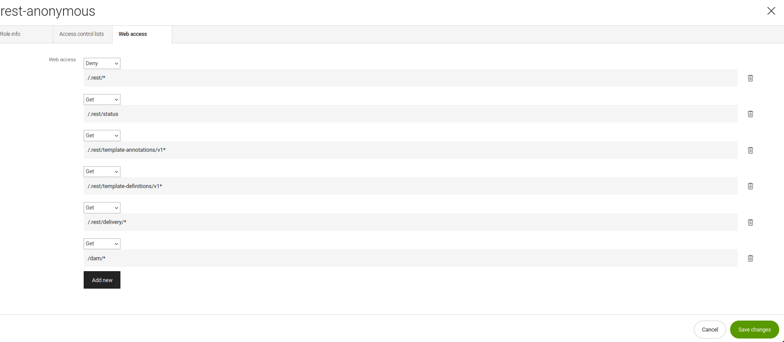

# Magnolia with SPA

# Setup

## Requirements

- Java (JDK)

- [Magnolia CLI](https://www.npmjs.com/package/@magnolia/cli) installed ([installation documentation](https://documentation.magnolia-cms.com/display/DOCS/Magnolia+CLI+v3))

## Install Magnolia with Magnolia CLI

In a terminal, navigate to the project directory and run:

```
mgnl jumpstart
```

Choose `magnolia-community-demo-webapp` or `magnolia-dx-core-demo-webapp` as the version to download.

> Note: If you want to try the personalization feature - you will need `dx-core`. To get `dx-core` you will need an enterprise account, please contact Magnolia Sales team if you do not have one.
> Additionally you will need the version 2.1.0 higher of the [personalization modules](https://docs.magnolia-cms.com/product-docs/6.2/Modules/List-of-modules/Personalization-module.html).

(Magnolia is downloaded.)

## Start Magnolia

From within the `magnolia` start Magnolia with:

```
mgnl start
```

Once the terminal shows `Server startup in X ms`

In your browser, open Magnolia at: http://localhost:8080/magnoliaAuthor/

## Accessing Magnolia

You can log in to Magnolia using the credentials **_username: `superuser`,
password: `superuser`._**
This will give you complete access to all content and configuration.

## Configuring REST and DAM security

### Content endpoint permissions

The app has anonymous access to Magnolia REST endpoints with no additional configuration because:

- "Web access" is allowed, because the restEndpoint files are under the `/delivery` path
- "Access contol list" access is allowed, beause the restEndponts have the `bypassWorkspaceAcls` property.

**NOTE** Allowing anonymous access may not be suitable for a production environment where you wish to keep data private.

### DAM

In order for images to be displayed:
Open the Security app, open the `Roles` tab, edit the `rest-anonymous` role, go to `Web access` tab, `Add new` with this path `/dam/*` set to GET.



In `Access control lists` tab modify `Dam` workspace by allowing `Read-only` access to `Selected and sub nodes` to `/`.

# Deploy your SPA

Build and deploy the SPA to make it available for editing.

### React

Go to `/react-headless` on the terminal and run `npm install`, and then `npm run start`.

See the `.env` files for important configurations.

